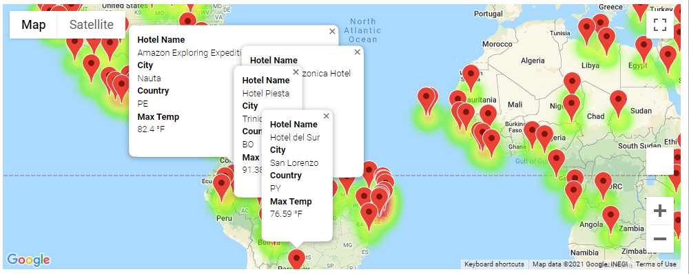
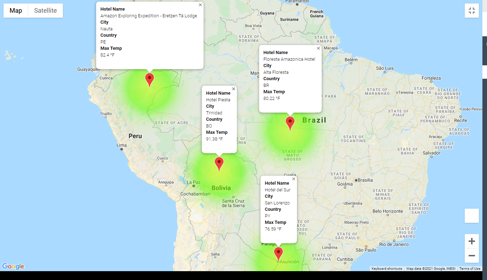
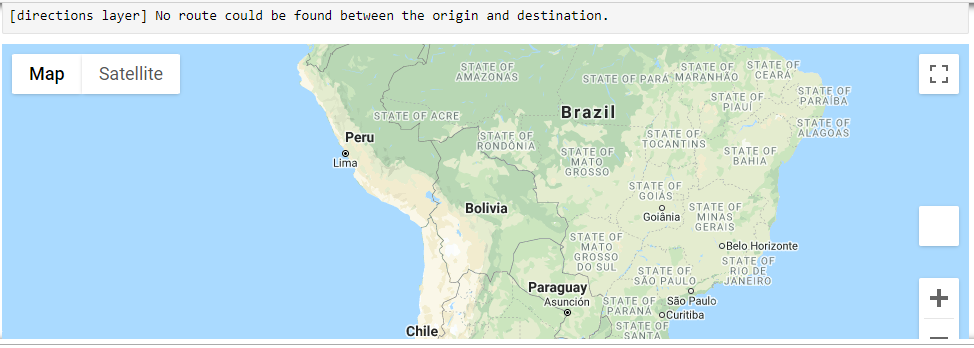

# World_Weather_Analysis
Utilizing APIs in Python to query data and to visualize various geopgraphic weather data

## Resources
- Python 3.8.5
- Jupyter Notebook 6.3.0
- OpenWeatherApp API
- Google Maps API 

## Project Overview
Create a trip planning app that will allow its user to choose cities based on initial temperature preferences and from those preferences identify potential hotels in these regions that they would like to stay. The app will allow a user to select up to 4 cities (including the start and endpoint) to travel to and can provide directions if possible by car, bike or walking. 

## Summary
The app works by asking it's user what temperature minimums and maximums they would be comfortable with on their travels. The app shows all the cities that meet that criteria.

After that has been selected, the countries that fit that criteria can be choosen. As seen here below:

The hotels can be selected in the 4 cities and the travel to each city from the startpoint can be seen. Unfortunately, in the example provided below, there is no accessible route to and from these cities. 

This is possibly due to the terrain of South America. Barring terrain or water, most routes can be shown using the app.
